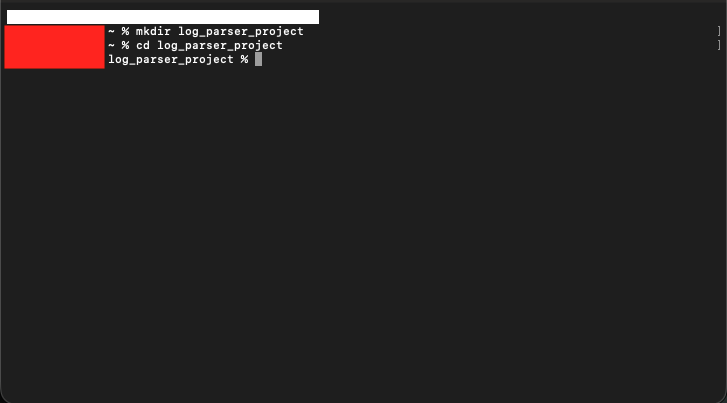
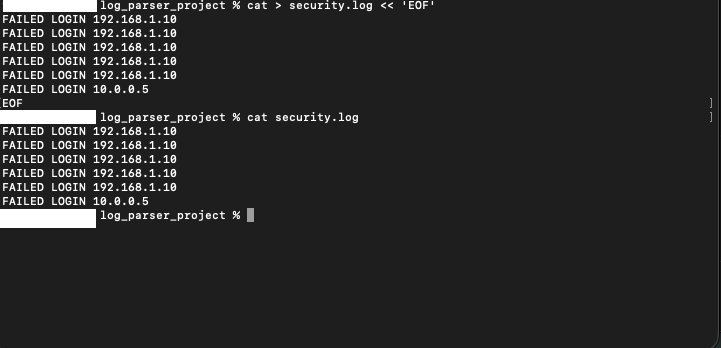
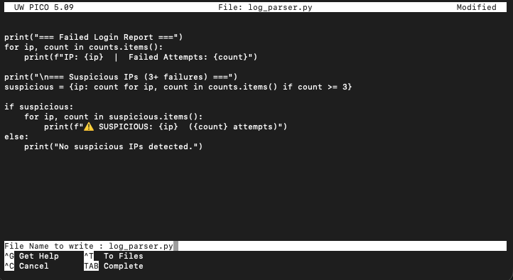
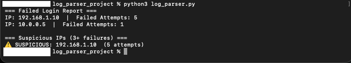
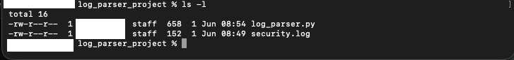

# 4️⃣ Automation Project

**Title:** Log Analysis Automation Using Python

---

## 📌 Objective

Build a Python script to:

- Read a log file
- Count failed logins
- Print suspicious IP

---

## 🛠️ Tools & Language

- **Language:** Python 3
- **Module:** `collections.Counter` (built-in)
- **Environment:** Mac Terminal
- **Files:** `security.log`, `log_parser.py`

---

## 💻 Code

```python
from collections import Counter

failed_ips = []

with open("security.log") as file:
    for line in file:
        if "FAILED LOGIN" in line:
            ip = line.split()[-1]
            failed_ips.append(ip)

counts = Counter(failed_ips)

for ip, count in counts.items():
    if count >= 5:
        print(f"Suspicious IP: {ip} - Attempts: {count}")
```

---

## 🧠 Explanation

**Why Counter?**

`Counter` is the built-in Python class from the `collections` module, that automatically counts how many times each unique value appears on a list. Without it, you would have to write a manual loop to keep track and increment counts yourself. This keeps the code efficient and clean.

**How Parsing Works**

The script reads `security.log` line by line. For each line, it checks whether `"FAILED LOGIN"` occurs. If it does, `line.split()[-1]` breaks the line into a list of words and chooses the last item, being the ip address. That IP is added to the `failed_ips` list. This is known as **log parsing** — extracting useful data from raw text.

**Threshold Logic**

After counting is done, the script loops through each IP and its count. The condition `if count >= 5` flags any IP with five or more failed attempts as suspicious. This demonstration mirrors how real security tools like **Fail2Ban** work. Only alerting when a pattern crosses a defined limit, not on every single failure.

---

## 🖼️ Screenshots

| # | Screenshot | Description |
|---|---|---|
| 1 |  | Project directory created and navigated into |
| 2 |  | `security.log` contents verified |
| 3 |  | Nano editor with code visible |
| 4 |  | Script output – suspicious IP flagged |
| 5 |  | File listing showing both files |

---

## 💡 Improvement Ideas

- **Export to CSV** — Write results to a `.csv` file using Python's `csv` module for simpler analysis
- **Send Email Alert** — Use `smtplib` to send an alert automatically when a suspicious IP is detected
- **Add Timestamp Filtering** — To filter entry logs by time windows to avoid false alerts from old data

---

## ⚠️ Notes

- The IP addresses used (`192.168.1.10`, `10.0.0.5`) are **private range IPs** — they are not traceable or real
- This is a **simulated environment** and is for educational purposes only
- All screenshots have been reviewed to redact personal identifying information
